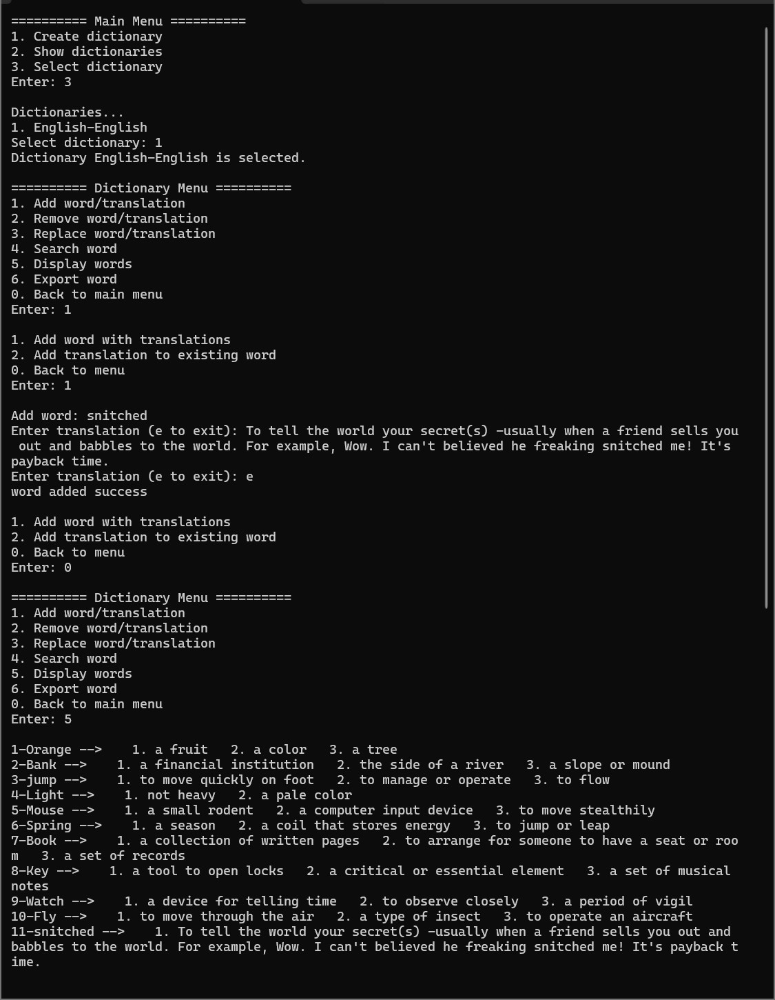

# C# Dictionary

This is a console-based Dictionary Application built in C# that allows users to create, manage, and interact with dictionaries in multiple languages.

## Features

- Create new dictionaries (e.g., English-Khmer, Spanish-French)
- View existing dictionaries
- Select and interact with specific dictionaries
- Add new words with multiple translations
- Add translations to existing words
- Remove words
- Remove translations from words
- Replace words
- Replace translations
- Search for words
- View all words in a dictionary
- Export individual words

## Getting Started

1. Clone the repository `https://github.com/Meimei07/csharp-dictionary.git`

2. Go to location: "csharp-dictionary\Practice-exam1\bin\Debug"

3. Run "Practice-exam1.exe"

## Demo

demonstration of adding new word/meaning and view all the words/meaning in the dictionary

